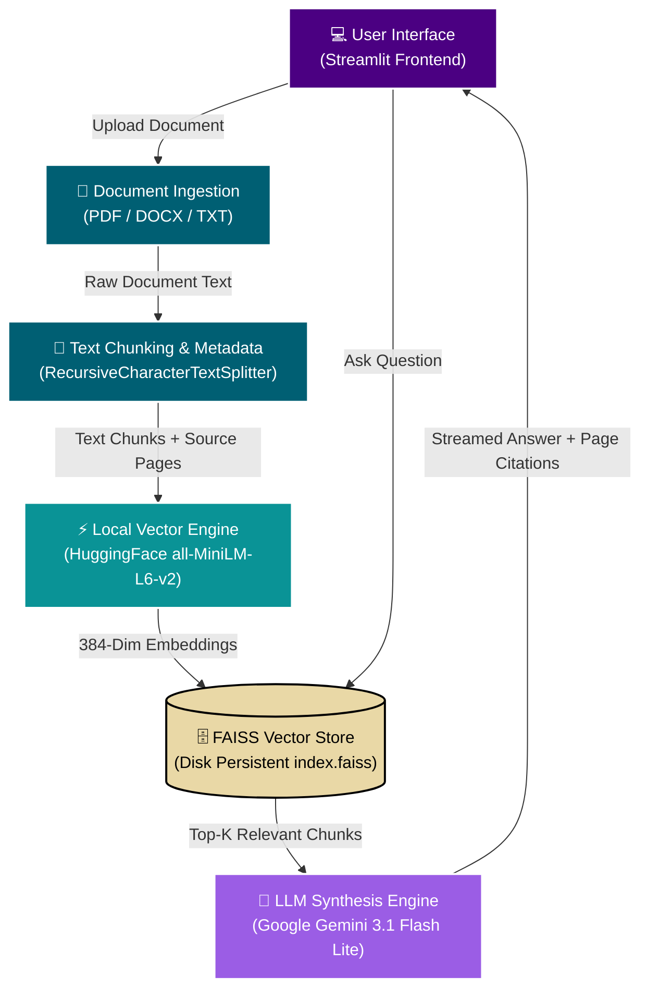

<div align="center">

# 📄 DocPulse AI
### *Enterprise-Grade RAG Intelligence Engine*

[](https://docpulse-ai.streamlit.app/)
[](https://python.org)
[](https://langchain.com)
[](https://github.com/facebookresearch/faiss)
[](https://ai.google.dev/)

[🌐 Live Demo](https://docpulse-ai.streamlit.app/) • [📖 System Architecture](#-system-architecture) • [🚀 Quickstart](#-quickstart-guide-local-setup)

---

</div>

## 📌 Overview

**DocPulse AI** is a production-grade Retrieval-Augmented Generation (RAG) platform designed for fast, accurate, and hallucination-resistant document intelligence.

By leveraging **Local HuggingFace Embeddings**, **FAISS Vector Indexing**, and **Google Gemini**, DocPulse AI extracts structured knowledge from unstructured PDFs, DOCX, and TXT files — while keeping document retrieval transparent with direct page/source citations.

---

## ⚡ System Architecture

### Visual Pipeline Flow



### Layer-by-Layer Breakdown

```
+-----------------------------------------------------------------------------------+
|                                  USER INTERFACE                                   |
|                        Streamlit Web App (st.session_state)                       |
+-----------------------------------------------------------------------------------+
                                         |
                                         v
+-----------------------------------------------------------------------------------+
|                             DOCUMENT INGESTION LAYER                              |
|           [PDF (PyMuPDF)]    |    [DOCX (python-docx)]    |    [TXT]              |
+-----------------------------------------------------------------------------------+
                                         |
                                         v
+-----------------------------------------------------------------------------------+
|                            TEXT CHUNKING & PREPROCESSING                          |
|                       Recursive Character Text Splitter                           |
|                      (Preserves Page & Source Metadata)                           |
+-----------------------------------------------------------------------------------+
                                         |
                                         v
+-----------------------------------------------------------------------------------+
|                             LOCAL EMBEDDING PIPELINE                              |
|                   HuggingFace: sentence-transformers/all-MiniLM-L6-v2             |
|                        (Zero API Cost / CPU-Optimized)                            |
+-----------------------------------------------------------------------------------+
                                         |
                                         v
+-----------------------------------------------------------------------------------+
|                              VECTOR INDEX & SEARCH                                |
|                        FAISS (Similarity Indexing)                                |
|                    Local Disk Persistence (`faiss_index/`)                        |
+-----------------------------------------------------------------------------------+
                                         |
                                         v
+-----------------------------------------------------------------------------------+
|                             LLM SYNTHESIS & CITATION                              |
|              Google Gemini API (gemini-3.1-flash-lite / 3-flash-preview)           |
|               Structured Prompt + Retrieved Context + Page Citations              |
+-----------------------------------------------------------------------------------+
```

---

## 🛠️ Tech Stack & Dependencies

| Category | Technology | Purpose |
| :--- | :--- | :--- |
| **Deployed Web App** | [Streamlit Cloud](https://docpulse-ai.streamlit.app/) | Production app hosting & user interface |
| **Document Parsers** | PyMuPDF (`fitz`), `python-docx` | High-fidelity multi-format text & page extraction |
| **Embedding Engine** | HuggingFace (`sentence-transformers`) | Local 384-dimensional dense vector creation |
| **Vector Index** | FAISS (Facebook AI Similarity Search) | High-performance similarity search & disk storage |
| **LLM Provider** | Google Gemini (`gemini-3.1-flash-lite`, `gemini-3-flash-preview`, `gemini-3.1-pro-preview`) | Generative context synthesis & stream output |
| **Language** | Python 3.10+ | Core pipeline orchestration |

---

## 🚀 Quickstart Guide (Local Setup)

### 1. Clone Repository & Navigate

```bash
git clone https://github.com/Anas-Nakhuda/DocPulseAI.git
cd DocPulseAI
```

### 2. Create and Activate Virtual Environment

```bash
# Windows
python -m venv venv
venv\Scripts\activate

# Linux / macOS
python3 -m venv venv
source venv/bin/activate
```

### 3. Install Dependencies

```bash
pip install -r requirements.txt
```

### 4. Configure Environment Variables

Create a `.env` file in the project root and add your Gemini API key:

```env
GOOGLE_API_KEY=your_actual_gemini_api_key_here
```

> **Tip:** Get your free API key at [Google AI Studio](https://aistudio.google.com/app/apikey).

### 5. Launch the Application

```bash
streamlit run app.py
```

The app will open automatically in your browser at `http://localhost:8501`.

---

## 🗂️ Project Structure

```
DocPulseAI/
├── app.py               # Main Streamlit application
├── eval.py              # Evaluation & benchmarking script
├── check_models.py      # Utility to verify available Gemini models
├── requirements.txt     # Python dependencies
├── .env                 # Environment variables (not committed)
└── faiss_index/         # Persisted FAISS vector index (auto-generated)
```

---

## 📊 Evaluation & Benchmarking

The `eval.py` script provides automated benchmarking of the RAG pipeline:

- **Retrieval accuracy** — measures whether the correct document chunks are returned for a given query
- **Answer faithfulness** — checks that the LLM answer is grounded in the retrieved context
- **Latency profiling** — tracks end-to-end response time per query

To run the evaluation:

```bash
python eval.py
```

---

<div align="center">

### 🌟 Support the Project

If you found **DocPulse AI** useful or interesting, please consider giving this repository a star on GitHub!

[](https://github.com/Anas-Nakhuda/DocPulseAI)

**[🚀 Launch DocPulse AI Live Demo](https://docpulse-ai.streamlit.app/)**

</div>

---

## 👤 Author

**Anas Nakhuda**

[](https://github.com/Anas-Nakhuda)